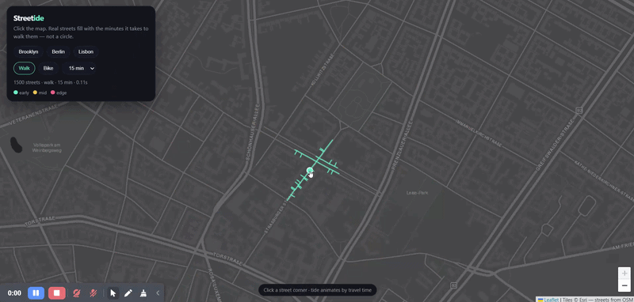

# Streetide

**Watch a city flood with walking time.**

Click a corner. The streets that are actually reachable light up in waves — alleys, bridges, dead ends. Not a circle on a map. A tide.



> Drop a real `docs/demo.gif` after you click Berlin once (screen-record 8–12 seconds). Until then the README still explains the trick.

## Why this exists

Isochrones are usually a blob. Cities are not blobs. A river, a rail yard, or a freeway **cuts** where you can walk, and that cut is the whole point.


## Quick start

Needs Python 3.10+ and a network the first time (OSM download, then cached).

```bash
uv sync
uv run streetide
```

Or:

```bash
pip install -e .
python -m streetide.app
```

Open [http://127.0.0.1:8000](http://127.0.0.1:8000), jump to Brooklyn / Berlin / Lisbon, click the map.

First request for a neighborhood can take ~10 seconds. After that the graph sits in `data/graphs/`.

## Stack

- FastAPI + Leaflet (dark CARTO tiles)
- OSMnx + NetworkX for the walk graph
- Travel times: **1.4 m/s walk**, **4.5 m/s bike**

No accounts, no tracking, no faces. Public map data only.

## License

MIT
